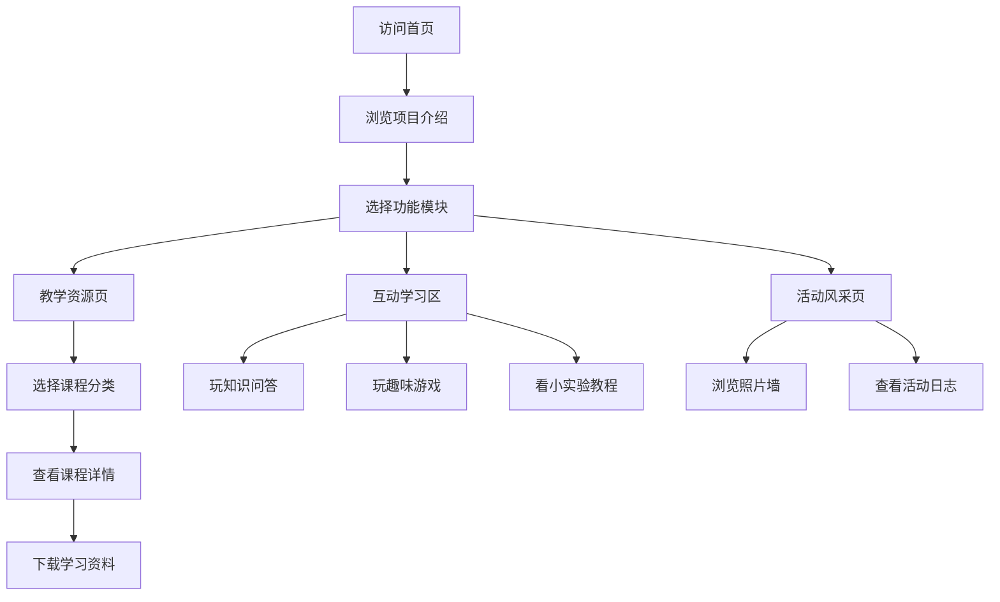

## 1. 产品概述

暑期三下乡教学组官方网站，面向6-12岁小学生提供趣味教学内容，同时作为项目宣传和成果展示平台。
- 主要目的：通过活泼有趣的网页形式，吸引小朋友参与学习，展示三下乡教学成果
- 目标用户：小学生、家长、志愿者团队、学校师生
- 产品价值：让支教教学更生动有趣，扩大项目影响力，留存教学资源

## 2. 核心功能

### 2.1 用户角色

| 角色 | 访问方式 | 核心权限 |
|------|----------|----------|
| 小朋友访客 | 直接访问 | 浏览课程、玩互动游戏、查看活动照片 |
| 家长访客 | 直接访问 | 了解项目、查看教学内容、活动风采 |
| 团队管理员 | 静态内容 | 展示团队介绍、教学成果（无需登录） |

### 2.2 功能模块

1. **首页（项目介绍）**：Hero 区域、团队介绍、教学亮点、快速导航
2. **教学资源页**：课程分类、课程卡片、课程详情、资料下载
3. **互动学习区**：趣味小游戏、知识问答、小实验教程
4. **活动风采页**：照片墙、活动日志、精彩瞬间

### 2.3 页面详情

| 页面名称 | 模块名称 | 功能描述 |
|----------|----------|----------|
| 首页 | 顶部导航 | 卡通风格导航栏，四个主菜单，滚动变色效果 |
| 首页 | Hero 区域 | 大标题 + 童趣插画，滚动视差效果，CTA 按钮 |
| 首页 | 团队介绍 | 教学组成员卡片，头像、姓名、特长介绍 |
| 首页 | 教学亮点 | 四大特色模块卡片，图标 + 简短描述 |
| 首页 | 快速入口 | 四个功能模块的快捷入口，悬浮动效 |
| 首页 | 页脚 | 团队信息、联系方式、友情链接 |
| 教学资源页 | 分类筛选 | 四大分类标签：科学科普、文化艺术、学业辅导、综合素质 |
| 教学资源页 | 课程列表 | 卡片式布局，课程封面、标题、适合年级、时长 |
| 教学资源页 | 课程详情 | 课程介绍、教学目标、知识点、相关资料下载 |
| 互动学习区 | 知识问答 | 趣味选择题，答对奖励小星星，进度条显示 |
| 互动学习区 | 趣味小游戏 | 记忆翻牌、拼图、连连看等简单互动游戏 |
| 互动学习区 | 小实验教程 | 在家可做的科学小实验，步骤图文说明 |
| 活动风采页 | 照片瀑布流 | 不规则瀑布流布局展示活动照片 |
| 活动风采页 | 活动时间线 | 按日期排列的活动日志，图文结合 |

## 3. 核心流程

## 4. 用户界面设计

### 4.1 设计风格
- **主色调**：天蓝色 (#4A90D9) + 阳光橙 (#FFB347) + 草地绿 (#7BC47F)
- **辅助色**：粉色 (#FF9EC3)、紫色 (#B19CD9)、明黄 (#FFE066)
- **背景色**：米白色 (#FFF8E7)，带有淡淡的云朵纹理
- **按钮风格**：圆润大圆角，渐变填充，带阴影和按压效果，像糖果一样可爱
- **字体**：标题使用圆润可爱的字体（如 "ZCOOL KuaiLe" 快乐体），正文使用清晰易读的无衬线字体
- **布局风格**：卡片式布局，大量圆角，柔和阴影，元素间有呼吸感
- **图标/emoji**：大量使用彩色 emoji 和手绘风格图标，增加童趣

### 4.2 页面设计概览

| 页面名称 | 模块名称 | UI 元素 |
|----------|----------|----------|
| 首页 | Hero 区域 | 大标题渐变文字，卡通云朵/太阳装饰，按钮弹跳动画，背景渐变 |
| 首页 | 教学亮点 | 四个彩色卡片，不同主题色，悬浮放大+旋转微动效 |
| 首页 | 团队介绍 | 圆形头像，彩色边框，名字艺术字，特长标签 |
| 教学资源页 | 课程卡片 | 圆角封面图，彩色分类标签，星星评分，适合年级徽章 |
| 互动学习区 | 问答界面 | 卡通对话框样式，选项按钮大而圆，答对撒花动效 |
| 活动风采页 | 照片瀑布流 | 错落有致的照片卡片，拍立得风格边框，悬浮放大 |

### 4.3 响应式设计
- 桌面端优先设计，适配平板和手机端
- 导航栏在移动端转为汉堡菜单
- 卡片布局自适应列数（桌面4列、平板2列、手机1列）
- 字体大小响应式调整
- 触摸操作优化，按钮和可点击区域足够大

### 4.4 动效设计
- 页面加载时元素依次淡入上移（stagger animation）
- 按钮悬停放大 + 阴影加深
- 卡片悬停轻微上浮 + 旋转
- 滚动触发视差效果
- 问答答对时撒花庆祝动效
- 页面间切换平滑过渡
