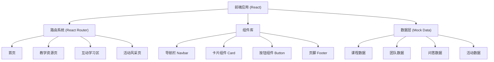

## 1. 架构设计



## 2. 技术描述

- **前端框架**: React@18 + TypeScript
- **构建工具**: Vite@5
- **样式方案**: TailwindCSS@3
- **路由管理**: React Router DOM@6
- **图标库**: Lucide React（配合 emoji 使用）
- **动画库**: Framer Motion（动效和交互）
- **后端**: 无后端，纯静态网站
- **数据**: 使用本地 Mock 数据，全部硬编码在前端
- **部署**: 静态文件部署（可部署到 GitHub Pages、Vercel、Netlify 等）

## 3. 路由定义

| 路由 | 页面名称 | 说明 |
|------|----------|------|
| / | 首页 | 项目介绍、团队展示、教学亮点、快速入口 |
| /courses | 教学资源页 | 课程分类、课程列表、课程详情 |
| /courses/:id | 课程详情页 | 单个课程的详细内容和资料 |
| /interactive | 互动学习区 | 知识问答、趣味游戏、小实验 |
| /gallery | 活动风采页 | 照片墙、活动时间线 |

## 4. 数据模型

### 4.1 课程数据模型

```typescript
interface Course {
  id: string;
  title: string;
  category: 'science' | 'culture' | 'academic' | 'quality';
  description: string;
  coverImage: string;
  grade: string;
  duration: string;
  difficulty: 'easy' | 'medium' | 'hard';
  tags: string[];
  content: string;
  objectives: string[];
  materials: string[];
  downloads: { name: string; url: string }[];
}
```

### 4.2 团队成员数据模型

```typescript
interface TeamMember {
  id: string;
  name: string;
  role: string;
  avatar: string;
  bio: string;
  skills: string[];
}
```

### 4.3 问答题目数据模型

```typescript
interface QuizQuestion {
  id: string;
  question: string;
  options: string[];
  correctAnswer: number;
  explanation: string;
  category: string;
}
```

### 4.4 活动数据模型

```typescript
interface Activity {
  id: string;
  title: string;
  date: string;
  description: string;
  images: string[];
}
```

### 4.5 记忆游戏数据模型

```typescript
interface MemoryCard {
  id: number;
  emoji: string;
  isFlipped: boolean;
  isMatched: boolean;
}
```

## 5. 组件结构

```
src/
├── components/
│   ├── Navbar.tsx          # 顶部导航栏
│   ├── Footer.tsx          # 页脚
│   ├── Button.tsx          # 通用按钮
│   ├── CourseCard.tsx      # 课程卡片
│   ├── TeamCard.tsx        # 团队成员卡片
│   ├── FeatureCard.tsx     # 特色卡片
│   ├── PhotoCard.tsx       # 照片卡片
│   └── QuizCard.tsx        # 问答卡片
├── pages/
│   ├── Home.tsx            # 首页
│   ├── Courses.tsx         # 教学资源页
│   ├── CourseDetail.tsx    # 课程详情页
│   ├── Interactive.tsx     # 互动学习区
│   └── Gallery.tsx         # 活动风采页
├── data/
│   ├── courses.ts          # 课程 mock 数据
│   ├── team.ts             # 团队 mock 数据
│   ├── quiz.ts             # 问答 mock 数据
│   └── activities.ts       # 活动 mock 数据
├── App.tsx
├── main.tsx
└── index.css
```

## 6. 性能优化策略

- 使用 React.lazy 进行代码分割，按需加载页面
- 图片使用适当格式和尺寸，支持懒加载
- 动画使用 CSS transform 和 opacity，保证流畅性
- 静态资源压缩，减小包体积
- 合理使用 React.memo 避免不必要的重渲染
